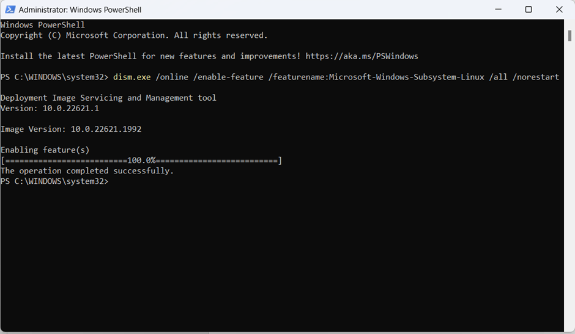
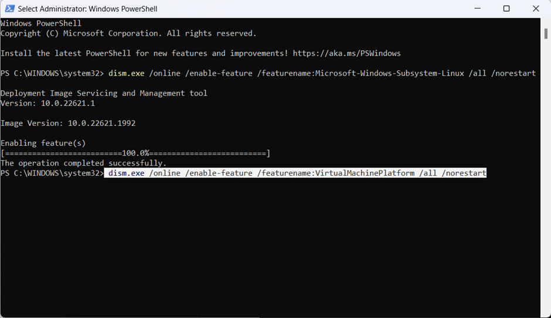

[](https://classroom.github.com/a/nj7iw4Wb)

# ABOUT ASSIGNMENT – WEEK 6 

--
## USE Windows Subsystem for Linux 2 and Ubuntu

1.	Make sure windows specifications are met :</br>
for version ≥ 1903
for build ≥ 18362
If not fulfilled, do a windows update first,


2.	Enable WSL on Windows using ```Windows PowerShell```, The steps can be seen on this site [learn.microsoft.com.](https://learn.microsoft.com/id-id/windows/wsl/install-manual)</br><ul>
a. Add : </br>
dism.exe /online /enable-feature /featurename:Microsoft-Windows-Subsystem-Linux /all /norestart</br>

</br></br>

</br></br>
b.	Add : </br>
dism.exe /online /enable-feature /featurename:VirtualMachinePlatform /all /norestart</br>

</br></br>

</br></br>
c.	Setelah semua selesai, restart perangkat
</ul></br>

3. Install WSL versi 2 : </br>
download linux kernel update package </br>
( https://wslstorestorage.blob.core.windows.net/wslblob/wsl_update_x64.msi )

</br></br>

</br></br>

4.	Open Windows Powershell to make sure it's installed and ubuntu will automatically be installed too. Here's a view from <i><b>Windows PowerShell</b></i></br>

    ```
    PS C:\WINDOWS\system32> wsl.exe --install
    Installing: Ubuntu
    Ubuntu has been installed.
    Launching Ubuntu...
    Installing, this may take a few minutes...
    Please create a default UNIX user account. The username does not need to match your Windows username.
    For more information visit: https://aka.ms/wslusers
    Enter new UNIX username: iman
    New password:
    Retype new password:
    passwd: password updated successfully
    Installation successful!
    ```

5. Open the ubuntu terminal check if it is active</br>
    ```
    iman@DESKTOP-7U0MED7:~$ whoami 
    iman
    iman@DESKTOP-7U0MED7:~$ sysinfo
    Command 'sysinfo' not found, did you mean:
      command 'xsysinfo' from deb xsysinfo (1.7-10)
      command 'rsysinfo' from deb rstat-client (4.0.1-11)
    Try: sudo apt install <deb name>
    iman@DESKTOP-7U0MED7:~$
    ```

6. All terminals WSL and Ubuntu are active

--

## USE Docker

### About Docker
What is Docker and why it is used?
Docker lets you build, test, and deploy applications quickly

Using Docker, you can quickly deploy and scale applications into any environment and know your code will run. Running Docker on AWS provides developers and admins a highly reliable, low-cost way to build, ship, and run distributed applications at any scale.

### Docker Image
A Docker image is a file used to execute code in a Docker container. Docker images act as a set of instructions to build a Docker container, like a template. Docker images also act as the starting point when using Docker. An image is comparable to a snapshot in virtual machine (VM) environments.

### Docker Container 
A container is an isolated environment for your code. This means that a container has no knowledge of your operating system, or your files. It runs on the environment provided to you by Docker Desktop. This is why a container usually has everything that your code needs in order to run, down to a base operating system.

### Docker Installation
1. Download [Docker](https://https://www.docker.com/).


2. Double click on __Docker Desktop Installer.exe__ to install the application. 


3. Check list two choice and click __Ok__ to install the application. If finish, can click __Close and restart__ to Restart your PC to complete the installation process..</br>

</br></br>

</br></br>

</br>
4. Click __Accept__ and next to continue the register.


5. __Settings__ your general docker. Finish


6. Open Windows Powershell and run it as an administrator.

7. Write ```docker --version``` to check complete the installation the Docker version.

--

## Visual Code, Windows Subsystem for Linux 2 and Ubuntu Connect/ Remote

1. Open __```Visual Studio```__.

2. Install _```WSL```_ Extension to remote visual code.</br>
  
3. After finish installation, press ctrl+shift+p
and type new than choice __“WSL:Connect to WSL using Distro”__</br>
  
4. Then press _```Ubuntu```_.</br>
  
5. Wait the process and then will notification in remote operation.
  </br></br>
  

--

## Steps to make a node.js until run it using a Docker container.

1. Open VSCode, clone the repository from GitHub to your local storage, open the folder, and create a new file named ```app.js```.
2. Copy the simple node.js project from github [https://gist.github.com/berdoezt/e51718982926f0caa3fcd8ed45111430](https://gist.github.com/berdoezt/e51718982926f0caa3fcd8ed45111430) and paste it into your VSCode ```app.js```.
3. Create a new file named package.json that contains some information about the project.
   ```
   {
    "name": "docker_web_app",
    "version": "1.0.0",
    "description": "Node.js on Docker",
    "author": "Iman Maris",
    "main": "app.js",
    "scripts": {
      "start": "node server.js"
    },
    "dependencies": {
      "express": "^4.18.2"
    }
    }
   ```

4. Create a new file named ```Dockerfile``` that contains:<ul>
    * ```FROM``` : define from what image we want to build from.
    * ```WORKDIR``` : a directory to hold the application code inside the image.
   * ```COPY``` : copy files from the directory.
   * ```RUN``` : execute commands to build image.
   * ```EXPOSE``` : ports where the container will listen.
   * ```CMD``` : commands to run the container.</ul>
   </br>
    ```
    FROM node:current-alpine

    WORKDIR /app

    COPY . .

    RUN npm install

    EXPOSE 3001

    CMD ["node", "app.js"]
    ```
5. Try to check your folder _```WEEK-6-MARISIMAN```_ in terminal.


6. After creating the dockerfile, we are going to build the project using ```WindowsPowerShell```. Check list images in your file before you build the new image with command : ```docker images```

</br></br>
And the next step for build that,
Open your ``WindowsPowerShell`` and use the command: 
  ```docker build. -t docker_web_app```.

   * `docker build` : name image to build an image using Docker.
   * `.` : specify the current directory to build Docker image.
   * `-t` : tag to your image to easily find it.
   * `docker_web_app` : name of the Docker image.
   </br></br>
   
   </br></br>
   * Can you check again your images list,
     
   </br></br>
7. After build the image, run the image using ``WindowsPowerShell`` with the command : ```docker run -p 3001:3001 docker_web_app:latest```.

   * ```docker run``` : to run the image.
   * ```-p 3001:3001``` : redirect local port to private port inside the container.
   * ```docker_web_app``` : name of the image.
   * ```:latest``` : refer the latest version of the image.
   </br></br>
   
</br></br>
8. When it is already running, can write command ```docker ps``` to check the container will appear in Docker Desktop.
</br>


9. Try to check your image in web with the adress ```localhost:3001```, and finish.


---
<i>`copyright by Iman`</i>


